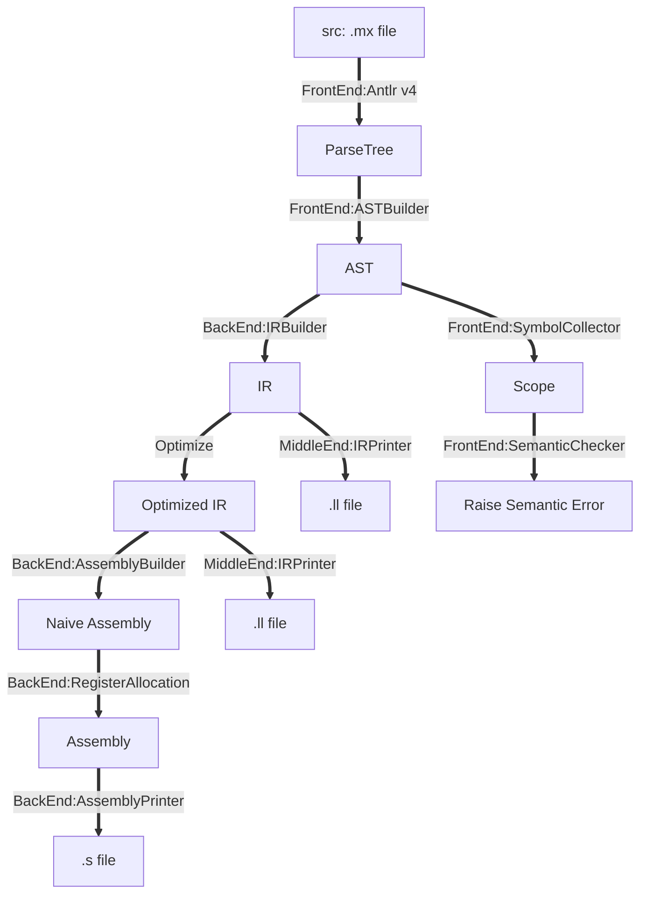

## Mx Compiler

A Compiler from Mx* language (C++ like) to RV32I Assembly, with static optimizations on LLVM IR, implemented in Java.

Mx* Syntax is introduced in the [course project](https://github.com/ACMClassCourses/Compiler-Design-Implementation).

### Features

1. Use Antlr library for front-end parser and lexer. Middle-end LLVM IR generation, back-end RV32I assembly codegen, static optimizations are all handwritten.

2. Static optimizations include Static Single-Assignment Form (SSA), Sparse Conditional Const Propagation (SCCP), Aggressive Dead Code Elimination (ADCE) and loop inline, following *Modern Compiler Implenentation in C*. 

3. A naive JIT interpreter. 

### Design

